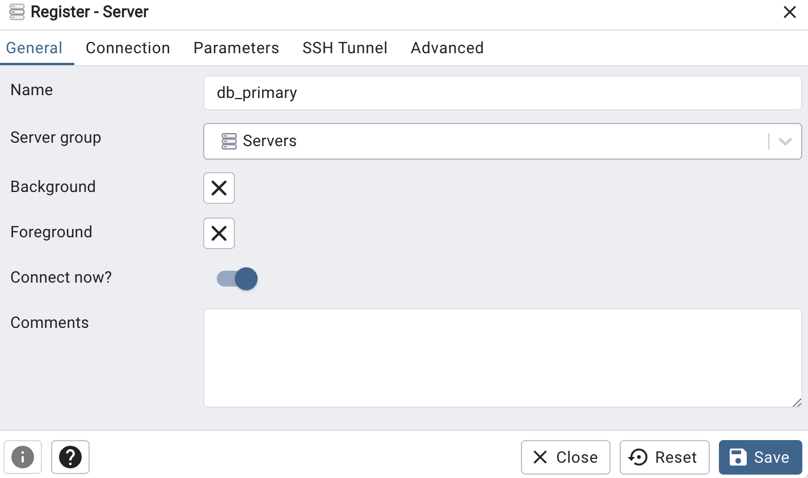
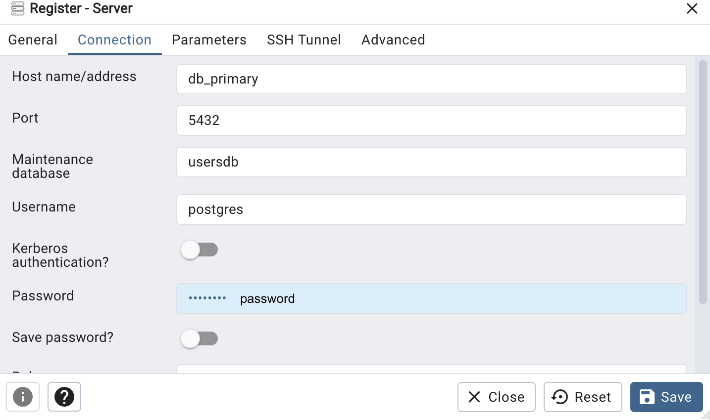
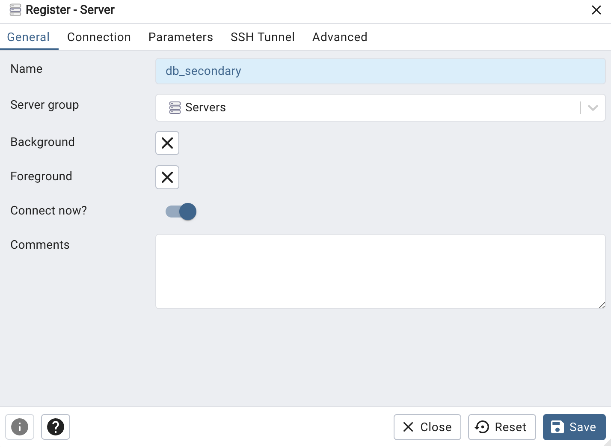
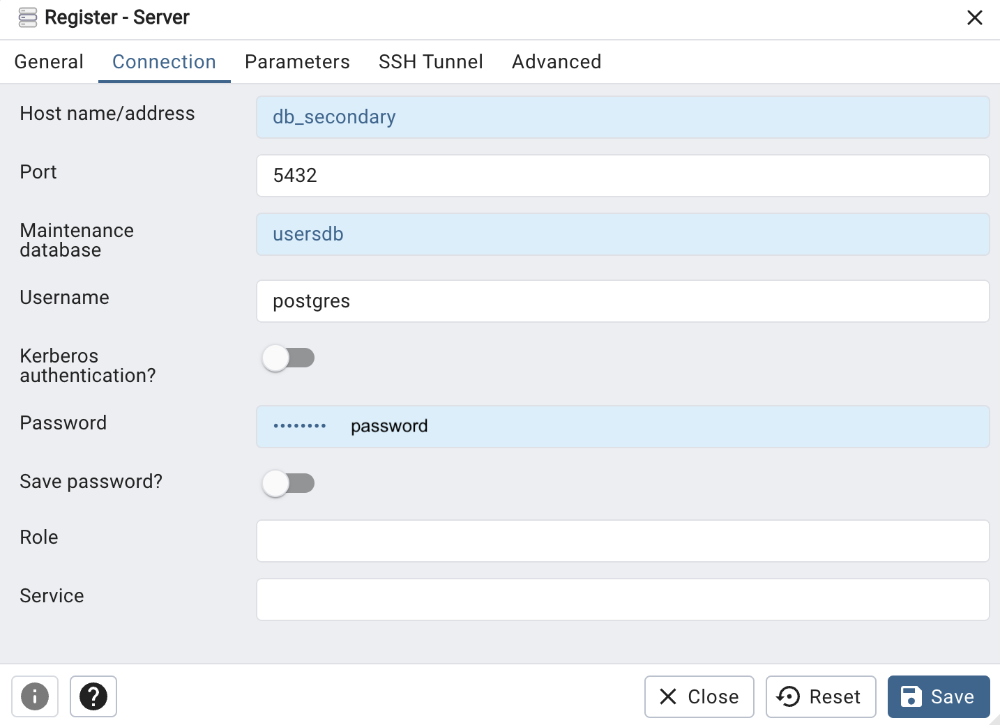

# words-cards Spring Boot Microservices REST API

This project implements a RESTful API using Spring Boot and adheres to a microservices architecture. It provides a flexible and scalable approach for word-cards application.

## Getting Started

### 1. Requirements:
- Java 17+
- Docker

### 2. Set Up Databases:
Run docker-compose file with databases:
```shell
cd _db
docker compose up -d
```
#### If you are running databases at firs time you need to configure the database, follow the steps bellow:
1. Access `pgAdmin` at http://localhost:5050/
2. Add New Server for `db_primary` with following properties:
<div>
    
    
</div>

3. Add New Server for `db_secondary` with following properties:
<div>
    
    
</div>

### 3. Run services
- Run `eureka-server` and other services after it

### 4. Verify Functionality:
Application contains services to manage and track services.
#### - pgAdmin 4 - http://localhost:5050/
#### - Eureka monitor - http://localhost:8761/

## Endpoints

 `Swagger UI` provides a comprehensive interface to explore and interact with API endpoints:

#### - Users Microservice Endpoints: http://localhost:9002/